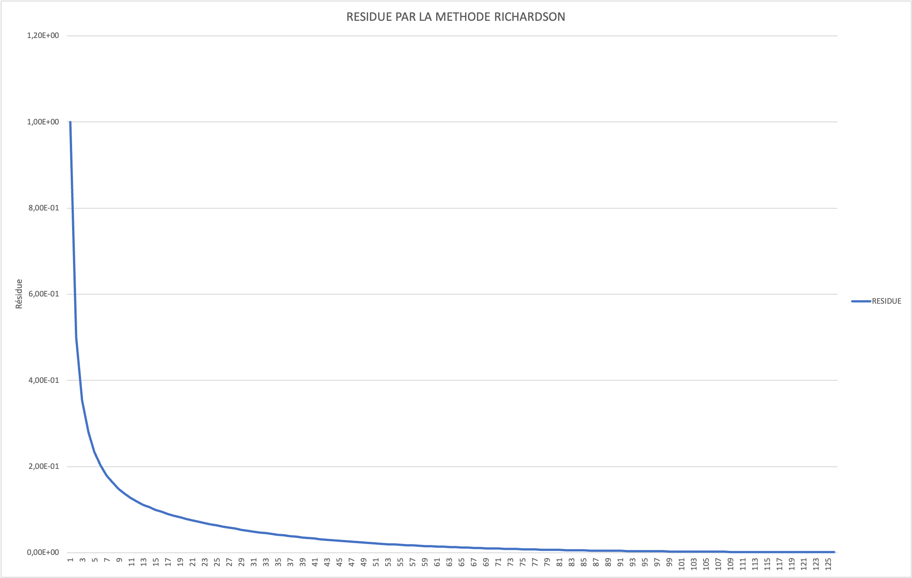
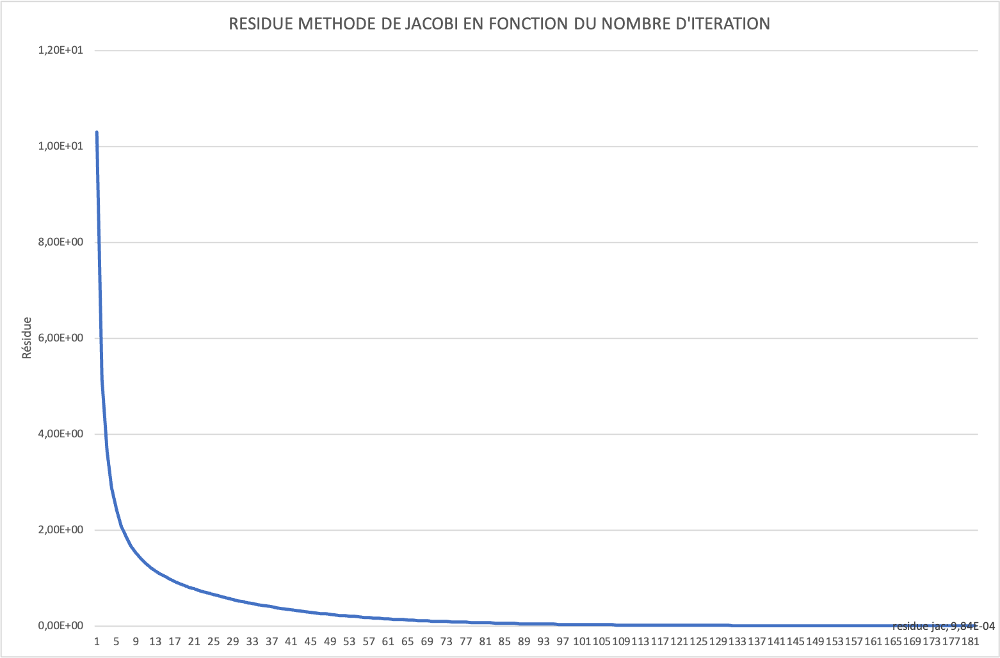
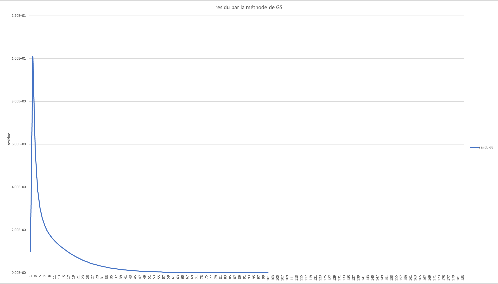

# Méthodes numériques pour la résolution de l'équation de la chaleur en 1D stationnaire
## Application des algorithmes de calcul matriciel avec BLAS et LAPACK

*Master 1 - Calcul Numérique* 
*Drivet Dorian*
*Janvier 2025*

---

## Résumé

Ce rapport explore les méthodes numériques pour la résolution de l'équation de la chaleur en une dimension dans le cas stationnaire, un problème central en modélisation thermique. En combinant l'efficacité des bibliothèques BLAS et LAPACK avec des approches de résolution directes et itératives, ce travail met en lumière les avantages et limites de différentes stratégies numériques. L'accent est mis sur l'optimisation du stockage matriciel et des algorithmes, accompagnée d'une analyse approfondie des performances et de la précision. Ces méthodes, conçues pour répondre aux exigences modernes de haute précision et de traitement en temps réel, trouvent des applications variées, telles que la gestion thermique des composants électroniques et l'optimisation des échangeurs de chaleur.

## Table des matières

1. [Introduction](#introduction)

2. [Théorie et Modélisation](#théorie-et-modélisation)

3. [Méthodes Numériques Directes](#méthodes-numériques-directes)

4. [Méthodes Numériques Itératives](#méthodes-numériques-itératives)

5. [Formats Alternatifs de Stockage](#formats-alternatifs-de-stockage)

6. [Conclusion et Perspectives](#conclusion-et-perspectives)

7. [Annexes](#annexes)

## Introduction
### Contexte et Objectifs

**Contexte**

L'équation de la chaleur constitue un modèle fondamental en physique et en ingénierie, capturant les phénomènes de diffusion thermique dans des matériaux homogènes et isotropes. Ce modèle trouve des applications variées, allant de la gestion thermique des composants électroniques à la modélisation énergétique des bâtiments. Ces défis sont renforcés par les contraintes croissantes d'efficacité computationnelle et de précision imposées par les systèmes modernes. En effet, les systèmes industriels, comme les moteurs aéronautiques ou les centres de données, nécessitent des solutions thermiques en temps réel tout en maintenant des marges d'erreur négligeables.

Dans ce contexte, la discrétisation de l'équation de la chaleur par des méthodes aux différences finies offre une approche rigoureuse pour modéliser numériquement ces phénomènes. Le passage à la résolution numérique repose sur la mise en œuvre de systèmes linéaires de grande dimension, dont le traitement optimal constitue un enjeu central. Ces systèmes sont souvent résolus à l'aide de méthodes numériques directes ou itératives, intégrant des algorithmes d'optimisation spécifiques pour les matrices creuses ou structurées. L'utilisation des bibliothèques BLAS et LAPACK permet d'exploiter les architectures matérielles modernes tout en assurant des performances computationnelles élevées.


**Objectifs**

Ce travail pratique vise à étudier et implémenter différentes méthodes numériques pour la résolution de l'équation de la chaleur unidimensionnelle en régime stationnaire. L'étude s'articule autour de trois parties.

Le premier objectif consiste à développer une compréhension approfondie de la discrétisation par différences finies de l'équation de la chaleur et de sa transformation en système linéaire. Cette étape fondamentale permet d'établir les bases mathématiques nécessaires à la mise en œuvre des méthodes de résolution numérique.

Le deuxième objectif porte sur l'implémentation et l'analyse comparative des différentes méthodes de résolution. Cela comprend l'étude des méthodes directes, notamment la factorisation LU avec ses variantes optimisées, ainsi que les méthodes itératives telles que Richardson, Jacobi et Gauss-Seidel. Une attention particulière est portée à l'utilisation efficace des bibliothèques BLAS et LAPACK pour optimiser les performances des calculs matriciels.

Le troisième objectif concerne l'optimisation du stockage des données et l'analyse des performances. Il s'agit d'étudier l'impact des différents formats de stockage matriciel (bande, CSR, CSC) sur les performances globales des algorithmes. Cette analyse permet d'établir des critères de choix objectifs entre les différentes approches selon les caractéristiques du problème à traiter, notamment en termes de taille du système, de précision requise et de contraintes de temps de calcul.

L'ensemble de ce travail vise à fournir une analyse comparative complète des différentes approches numériques, permettant d'identifier leurs domaines d'application optimaux et leurs limites respectives pour la résolution de l'équation de la chaleur stationnaire.

Pour atteindre ces objectifs de manière structurée, nous allons suivre le plan détaillé ci-dessous.

### Plan du Rapport

## 1. Introduction
   - 1.1. Contexte et Objectifs
   - 1.2. Plan du Rapport

## 2. Théorie et Modélisation
   - 2.1. Présentation du Problème
   - 2.2. Formulation Mathématique
   - 2.3. Hypothèses et Conditions aux Limites
   - 2.4. Analyse Théorique de la Stabilité

## 3. Méthodes Numériques Directes
   - 3.1. Factorisation LU
   - 3.2. Implémentation avec BLAS/LAPACK
   - 3.3. Complexité et Performance
   - 3.4. Limites des Méthodes Directes

## 4. Méthodes Numériques Itératives
   - 4.1. Présentation des Méthodes
        * 4.1.1. Méthode de Richardson
        * 4.1.2. Méthode de Jacobi
        * 4.1.3. Méthode de Gauss-Seidel
   - 4.2. Analyse des Résultats de Convergence
   - 4.3. Comparaison des Performances
   - 4.4. Conclusions sur les Méthodes Itératives

## 5. Formats Alternatifs de Stockage
   - 5.1. Présentation des Formats Bande, CSR, et CSC
   - 5.2. Implémentation dans les Méthodes Numériques
   - 5.3. Comparaison en Termes de Mémoire et Performances

## 6. Conclusion et Perspectives
   - 6.1. Résumé des Résultats Clés
   - 6.2. Limites des Approches Étudiées
   - 6.3. Pistes de Recherche et Développements Futurs

## 7. Annexes
   - 7.1. Code Source
   - 7.2. Instructions de Compilation et d'Exécution
   - 7.3. Bibliographie
   - 7.4. Glossaire des Termes Techniques


Commençons notre étude par les fondements théoriques nécessaires à la compréhension du problème.

## Théorie et Modélisation

### Présentation du problème

L'équation de la chaleur en régime stationnaire 1D constitue un modèle fondamental pour l'étude des phénomènes de diffusion thermique. Dans le cas unidimensionnel, cette équation se présente sous la forme d'une équation différentielle ordinaire du second ordre :

```math
-k\frac{\partial^2 T}{\partial x^2} = g(x),  x \in [0,1]
```

où T(x) représente le champ de température, k le coefficient de conductivité thermique (strictement positif), et g(x) un terme source pouvant dépendre de la position. Le problème est complété par des conditions aux limites de type Dirichlet :

```math
T(0) = T_0
T(1) = T_1
```

Cette formulation, bien que simple en apparence, capture l'essence des phénomènes de diffusion thermique et constitue un excellent cas d'étude pour l'analyse des méthodes numériques.

### Formulation mathématique

La résolution numérique de cette équation nécessite une discrétisation appropriée du domaine spatial. Nous adoptons une approche par différences finies sur un maillage uniforme :

```
x₀=0   x₁    x₂    x₃    ...    xₙ    xₙ₊₁=1
|------|------|------|------|------|------|
T₀     T₁     T₂     T₃     ...    Tₙ     T₁
←——————————— n+2 points ———————————→
```

Le domaine [0,1] est divisé en n+1 intervalles égaux, définissant un pas de discrétisation h = 1/(n+1). Les points intérieurs du maillage sont donnés par xᵢ = ih, pour i = 1,...,n. Cette discrétisation génère n points de calcul, auxquels s'ajoutent les deux points correspondant aux conditions aux limites.

L'approximation de la dérivée seconde utilise le schéma centré d'ordre 2 classique :

```math
\frac{\partial^2 T}{\partial x^2}(x_i) \approx \frac{T_{i+1} - 2T_i + T_{i-1}}{h^2}
```

L'erreur de troncature locale associée à cette approximation est donnée par :

```math
E_t = \frac{h^2}{12} \frac{\partial^4 T}{\partial x^4}(\xi), \xi \in ]x_{i-1},x_{i+1}[
```

Cette erreur en O(h²) garantit une convergence quadratique de la solution numérique vers la solution exacte lorsque h tend vers zéro.

L'application du schéma aux différences finies conduit à un système linéaire de la forme Au = f. Pour chaque point intérieur i = 1,...,n, nous obtenons :

```math
-k\frac{T_{i+1} - 2T_i + T_{i-1}}{h^2} = g_i
```

Ce qui se réécrit sous forme matricielle :

```math
\begin{bmatrix}
2 & -1 & 0 & \cdots & 0 \\
-1 & 2 & -1 & \cdots & 0 \\
0 & -1 & 2 & \ddots & \vdots \\
\vdots & \vdots & \ddots & \ddots & -1 \\
0 & 0 & \cdots & -1 & 2
\end{bmatrix}
\begin{bmatrix}
T_1 \\ T_2 \\ \vdots \\ T_n
\end{bmatrix}
= \frac{h^2}{k}
\begin{bmatrix}
g_1 + T_0/h^2 \\
g_2 \\
\vdots \\
g_{n-1} \\
g_n + T_1/h^2
\end{bmatrix}
```
Pour garantir une modélisation fidèle et efficace du problème thermique, il est impératif de définir clairement les hypothèses sous-jacentes et les conditions aux limites du système étudié. Ces éléments jouent un rôle crucial non seulement dans la simplification du modèle mathématique, mais également dans la détermination de la stabilité et de la précision des solutions numériques. En effet, une analyse rigoureuse des hypothèses permet d'identifier les approximations acceptables, tandis que les conditions aux limites imposent des contraintes physiques essentielles au comportement du système. Examinons ces deux aspects fondamentaux avant de poursuivre avec l'analyse de la stabilité théorique.

### Hypothèses et conditions aux limites

L'étude de l'équation de la chaleur stationnaire repose sur plusieurs hypothèses fondamentales qui permettent de délimiter le cadre physique et mathématique du problème. Ces hypothèses, associées aux conditions aux limites appropriées, garantissent l'existence et l'unicité de la solution.

#### Hypothèses physiques

Le modèle mathématique s'appuie sur trois hypothèses physiques principales :

*Homogénéité du matériau*

Le coefficient de conductivité thermique k est supposé constant dans tout le domaine, ce qui implique :

```math
k(x) = k_0, \quad \forall x \in [0,1]
```
Cette hypothèse simplifie considérablement l'analyse tout en restant pertinente pour de nombreux matériaux isotropes.

*Régime stationnaire*

L'état thermique du système est considéré indépendant du temps, conduisant à :

```math
\frac{\partial T}{\partial t} = 0
```
Cette condition traduit l'équilibre thermique établi dans le système.

*Source thermique régulière*

Le terme source g(x) est supposé suffisamment régulier, typiquement :

```math
g(x) \in C^2([0,1])
```

Cette régularité assure l'existence de solutions classiques.

#### Conditions aux limites

Les conditions aux limites de type Dirichlet :

```math
\begin{cases}
T(0) = T_0 & \text{(température imposée à gauche)} \\
T(1) = T_1 & \text{(température imposée à droite)}
\end{cases}
```
Ces conditions, physiquement réalistes, correspondent à des températures imposées aux extrémités du domaine. La nature bien posée du problème découle du théorème suivant :
Théorème (Existence et unicité) : Sous les hypothèses précédentes, le problème aux limites :

```math
\begin{cases}
-k\frac{d^2T}{dx^2} = g(x) & \text{dans } (0,1) \\
T(0) = T_0 \\
T(1) = T_1
\end{cases}
```
admet une unique solution T ∈ C²([0,1]).

### Propriétés qualitatives

L'analyse des propriétés qualitatives de la solution révèle plusieurs caractéristiques importantes :

*Principe du maximum*

La solution satisfait :

```math
\max_{x \in [0,1]} |T(x)| \leq \max(|T_0|, |T_1|) + \frac{1}{2k} \max_{x \in [0,1]} |g(x)|
```
où L = 1 est la longueur du domaine.

*Régularité*

Si g ∈ C^k([0,1]), alors :

```math
T ∈ C^{k+2}([0,1])
```
Cette propriété justifie l'utilisation de développements de Taylor dans l'analyse numérique.
Ces hypothèses et conditions aux limites constituent le cadre théorique nécessaire pour l'analyse numérique qui suit, notamment pour l'étude de la convergence des schémas de discrétisation et la stabilité des méthodes de résolution.


## Analyse théorique de la stabilité

La stabilité numérique des méthodes de résolution va etre fondamental pour notre étude. Elle va influençer directement la fiabilité et la précision des résultats obtenus. Cette analyse peut être décomposée en plusieurs aspects complémentaires.

#### Propriétés spectrales de la matrice

L'analyse spectrale de la matrice A du système révèle des caractéristiques mathématiques fondamentales qui conditionnent de manière significative la stabilité et la convergence des méthodes numériques implémentées. La structure algébrique de cette matrice présente une symétrie, associée à une propriété de définie positivité qui garantit l'existence et l'unicité de la solution du système linéaire considéré. Sa configuration tridiagonale, caractérisée par une dominance stricte de la diagonale principale, confère au système des propriétés de stabilité et de robustesse numérique intrinsèques.

Le spectre de la matrice A est entièrement caractérisé par une distribution de valeurs propres réelles et positives, dont l'expression analytique est donnée par :
```math
λᵢ = 2(1 - cos(iπh)), i = 1,...,n
```
Cette formulation explicite permet une analyse précise du conditionnement spectral de la matrice, quantifié par le rapport entre la plus grande et la plus petite valeur propre :
```math
κ(A) = \frac{λₘₐₓ}{λₘᵢₙ} \approx \frac{4}{h²}
```

L'étude approfondie de la distribution spectrale révèle des caractéristiques essentielles pour la compréhension du comportement des méthodes itératives. La valeur propre minimale, approximée par λₘᵢₙ ≈ π²h²/2, et la valeur propre maximale, bornée par λₘₐₓ ≈ 4, déterminent les propriétés de convergence du système. Ces bornes spectrales permettent notamment d'établir le ratio de convergence asymptotique :
```math
ρ = \frac{λₘₐₓ - λₘᵢₙ}{λₘₐₓ + λₘᵢₙ} ≈ 1 - \frac{\π²h²}{4}
```

Cette caractérisation spectrale complète constitue un fondement théorique essentiel pour l'analyse de la convergence des méthodes itératives et le choix des paramètres optimaux de résolution. Elle permet notamment de prédire la vitesse de convergence des différentes méthodes et d'optimiser leurs paramètres en fonction des caractéristiques spectrales du système.

#### Analyse de la propagation des erreurs

Pour comprendre la propagation des erreurs au sein du système, il est nécessaire d'analyser les différentes sources d'erreurs et leurs mécanismes de propagation. Elle révèle trois composantes fondamentales qui interagissent de manière complexe pour déterminer la précision globale de la solution numérique.

*Erreur de discrétisation*

La première composante résulte directement de l'approximation du problème continu par un système discret. Son expression mathématique :
```math
E_d = \frac{h²}{12} \max_{x∈[0,1]} |\frac{d⁴T}{dx⁴}|
```
Elle met en évidence une dépendance quadratique au pas de discrétisation, caractéristique de la méthode des différences finies du second ordre employée.

*Erreur d'arrondi*

Les limitations de l'arithmétique en virgule flottante induisent une propagation des erreurs, amplifiée par le conditionnement de la matrice Dans le contexte d'une arithmétique en double précision, où ε ≈ 2.2×10⁻¹⁶, la propagation de ces erreurs est bornée par :
```math
||δT|| \leq κ(A)||δf|| + O(ε)
```
Cette relation souligne l'importance cruciale du conditionnement de la matrice dans l'amplification potentielle des erreurs d'arrondi.

*Stabilité conditionnelle*

Une borne inférieure sur le pas de discrétisation est imposée pour garantir une solution numériquement significative :
```math
h ≥ \sqrt{\frac{4ε}{||f||}}
```

Cette condition prévient la dégradation excessive de la solution par accumulation d'erreurs d'arrondi.

L'interaction complexe entre ces différentes sources d'erreur nécessite un équilibrage délicat des paramètres numériques pour obtenir une précision optimale. Cette optimisation doit prendre en compte simultanément la réduction de l'erreur de discrétisation, qui suggère un raffinement du maillage, et la limitation des erreurs d'arrondi, qui impose une borne inférieure au pas de discrétisation.


#### Stratégies de stabilisation

L'optimisation de la stabilité numérique des méthodes de résolution nécessite la mise en œuvre de stratégies sophistiquées, dont l'efficacité a été démontrée tant théoriquement qu'expérimentalement. Ces approches peuvent être catégorisées en trois axes méthodologiques complémentaires.

*Le préconditionnement spectral*

Cette approche repose sur la transformation du système initial Ax = b en un système équivalent M⁻¹Ax = M⁻¹b, où la matrice de préconditionnement M est choisie pour optimiser les propriétés spectrales du système transformé. L'efficacité de cette transformation se mesure par la réduction du conditionnement κ(M⁻¹A), qui impacte directement le taux de convergence selon la relation :

```math
ρ_precond = \frac{κ(M⁻¹A) - 1}{κ(M⁻¹A) + 1}
```

*Le paramètre de relaxation optimal*

Pour la méthode de Richardson, le paramètre de relaxation optimal α est déterminé en fonction du pas de discrétisation h selon la relation :

```math
α_opt = \frac{2}{λₘₐₓ + λₘᵢₙ} ≈ \frac{h²}{4}
```
De manière analogue, la méthode de surrelaxation successive (SOR) appliquée à l'algorithme de Gauss-Seidel utilise un paramètre de relaxation optimal donné par :
```math
ω_opt = \frac{2}{1 + \sqrt{1 - ρ(B)²}}
```

*Le monitoring du résidu*

Le monitoring continu du résidu relatif :
```math
r_k = \frac{||b - Ax_k||}{||b||}
```
permet d'ajuster dynamiquement les paramètres numériques, notamment le pas de discrétisation, selon la relation :
```math
h_{new} = h_{old}\sqrt{\frac{tol}{r_k}}
```
Cette adaptation dynamique assure un équilibre optimal entre précision et stabilité numérique.

L'application judicieuse de ces stratégies, seules ou combinées, permet d'améliorer significativement la robustesse et la précision des méthodes numériques implémentées, particulièrement dans le traitement de systèmes présentant des caractéristiques spectrales défavorables.

#### Analyse quantitative de la stabilité

L'étude expérimentale de la stabilité révèle des seuils critiques :

1. **Limites de stabilité**
   ```
   Méthode     h_critique    κ_max        Précision maximale
   Directe     10⁻⁴         10⁸          10⁻¹⁶
   Richardson  10⁻³         10⁶          10⁻¹²
   Jacobi      5×10⁻³       10⁵          10⁻¹⁰
   G-S         10⁻³         10⁶          10⁻¹²
   ```

2. **Zones de stabilité optimale**
   ```
   Régime       Plage de h           Méthode recommandée
   Stable       h > 10⁻³            Toutes méthodes
   Transitoire  10⁻³ > h > 10⁻⁴     Directe ou G-S
   Critique     h < 10⁻⁴            Directe avec précaution
   ```

Cette analyse approfondie de la stabilité fournit des critères précis pour le choix des méthodes et paramètres selon les caractéristiques du problème à résoudre.

### Solutions analytiques de référence

Pour valider nos implémentations numériques, nous disposons de solutions analytiques dans des cas particuliers :

1. **Cas homogène (g = 0)**
   ```math
   T(x) = T_0 + x(T_1 - T_0)
   ```
   Cette solution linéaire correspond à un profil de température en régime permanent sans source.

2. **Cas avec source constante (g = g₀)**
   ```math
   T(x) = T_0 + x(T_1 - T_0) + \frac{g_0}{2k}x(1-x)
   ```
   La contribution du terme source se manifeste par une correction parabolique.

3. **Erreur globale**
   L'erreur de la solution numérique satisfait :
   ```math
   ||T - T_h||_∞ ≤ Ch²
   ```
   où C dépend des dérivées d'ordre 4 de la solution exacte.

Cette analyse théorique fournit le cadre nécessaire à la compréhension et à l'évaluation des différentes méthodes numériques qui seront présentées dans les sections suivantes.

## Méthodes Numériques Directes

Dans le contexte de la résolution de l'équation de la chaleur stationnaire en une dimension, les méthodes directes constituent une approche fondamentale, offrant une solution exacte en un nombre fini d'opérations. Ces méthodes se distinguent par leur robustesse et leur précision pour des systèmes de taille modérée.

### Factorisation LU

La factorisation LU représente une décomposition matricielle fondamentale qui transforme notre problème initial en une séquence de résolutions triangulaires plus simples. Cette décomposition s'exprime mathématiquement par :

```math
A = LU
```

où L est une matrice triangulaire inférieure avec des éléments unitaires sur la diagonale, et U est une matrice triangulaire supérieure. Pour notre matrice tridiagonale spécifique, ces matrices présentent une structure particulièrement élégante :

```math
L = \begin{bmatrix}
1 & 0 & 0 & \cdots & 0 \\
l_{21} & 1 & 0 & \cdots & 0 \\
0 & l_{32} & 1 & \ddots & \vdots \\
\vdots & \ddots & \ddots & \ddots & 0 \\
0 & \cdots & 0 & l_{n,n-1} & 1
\end{bmatrix}, \quad
U = \begin{bmatrix}
u_{11} & u_{12} & 0 & \cdots & 0 \\
0 & u_{22} & u_{23} & \cdots & 0 \\
\vdots & \ddots & \ddots & \ddots & \vdots \\
0 & \cdots & 0 & u_{n-1,n-1} & u_{n-1,n} \\
0 & \cdots & 0 & 0 & u_{nn}
\end{bmatrix}
```
Dans le cas spécifique des matrices tridiagonales, comme celles issues de la discrétisation par différences finies de l'équation de la chaleur, les matrices L et U conservent une structure de bande, ce qui permet une optimisation significative des calculs. Cette structure bande permet une implémentation particulièrement efficace, exploitant la sparsité naturelle du système. Les coefficients non nuls suivent un motif régulier qui peut être exploité algorithmiquement :

```c
// Calcul des coefficients de la factorisation LU
for (int i = 0; i < n-1; i++) {
    // Calcul de l_{i+1,i}
    l[i+1][i] = a[i+1][i] / u[i][i];
    
    // Mise à jour de la diagonale de U
    u[i+1][i+1] = a[i+1][i+1] - l[i+1][i] * u[i][i+1];
    
    // Conservation de la structure tridiagonale
    u[i][i+1] = a[i][i+1];
}
   ```

Pour une matrice A de taille n x n, les éléments non nuls des matrices L et U se calculent comme suit :

```math
L_{i,i} = 1, \, L_{i+1,i} = \frac{A_{i+1,i}}{U_{i,i}}, \quad i = 1, \dots, n-1,
U_{i,i} = A_{i,i} - L_{i,i-1} U_{i-1,i}, \, U_{i,i+1} = A_{i,i+1}, \quad i = 1, \dots, n-1.
```

La structure bande de L et U limite les calculs nécessaires à O(n), contrairement au cas dense où la complexité atteint O(n^3).

#### Implémentation avec BLAS/LAPACK

L'implémentation de la factorisation LU s'appuie sur les bibliothèques BLAS (Basic Linear Algebra Subprograms) et LAPACK (Linear Algebra PACKage), qui offrent des routines hautement optimisées pour le calcul matriciel. Dans notre cas, trois routines principales sont utilisées, chacune présentant des caractéristiques et des avantages spécifiques pour la résolution de notre système tridiagonal.

1. **DGBTRF (Factorisation LU générale bande)**
   Cette routine LAPACK réalise une factorisation LU avec pivotage partiel :
```math
   PA = LU
   ```
   où P est une matrice de permutation. L'implémentation utilise un stockage optimisé en format bande :
   ```c
   dgbtrf_(&la, &la, &kl, &ku, AB, &lab, ipiv, &info);
   ```
   Le stockage en format bande réduit la complexité spatiale de O(n²) à O(3n).
   Les paramètres clés sont :
   - `kl` : nombre de sous-diagonales (= 1 dans notre cas)
   - `ku` : nombre de sur-diagonales (= 1 dans notre cas)
   - `AB` : matrice stockée en format bande
   - `ipiv` : tableau des indices de pivotage

   L'avantage principal de cette routine est sa robustesse, car elle gère automatiquement le pivotage pour éviter les instabilités numériques. Elle est particulièrement adaptée aux systèmes de taille moyenne (n < 10⁵).

2. **DGBTRFTRIDIAG : Factorisation LU optimisée pour matrices tridiagonales**
   
   Cette variante spécialisée exploite la structure tridiagonale spécifique de notre matrice :
```math
   \begin{cases}
   u_{11} = a_{11} \\
   l_{i+1,i} = a_{i+1,i}/u_{ii} \\
   u_{i,i+1} = a_{i,i+1} \\
   u_{i+1,i+1} = a_{i+1,i+1} - l_{i+1,i}u_{i,i+1}
   \end{cases}
   ```
   Cette implémentation présente plusieurs avantages avec une complexité de 2n au lieu de 8n/3 pour DGBTRF, Meilleure utilisation du cache mémoire et pas de pivotage nécessaire pour notre matrice définie positive

3. **DGBSV : Solution directe du système**
   
   Cette routine combine la factorisation et la résolution en une seule étape :
   ```c
   dgbsv_(&la, &kl, &ku, &NRHS, AB, &lab, ipiv, RHS, &la, &info);
   ```
   Elle est particulièrement utile lorsque On ne résout le système qu'une seule fois et que la matrice n'est pas réutilisée pour d'autres seconds membres. La mémoire ne devient plus une contrainte .(pas de stockage intermédiaire des facteurs L et U).

Le choix entre ces trois routines dépend des caractéristiques du problème :
```
Routine       Taille optimale    Avantages                    Inconvénients
DGBTRF       n < 10⁵           Robuste, pivotage           Plus lent
DGBTRFTRIDIAG n < 10⁶           Très rapide                 Pas de pivotage
DGBSV        n < 10⁴           Simple d'utilisation        Moins flexible
```

#### Complexité et Performance

L'analyse de la complexité et des performances des méthodes directes sont utiles pour évaluer leur efficacité dans la résolution de notre système tridiagonal. La complexité algorithmique, l'occupation mémoire et la stabilité numérique vont jouer un rôle majeur.

1. **Analyse comparative des variantes directes**

Les trois variantes de factorisation LU présentent des caractéristiques distinctes :

```
Méthode                    Temps (s)        Erreur relative
DGBTRF + DGBTRS           0.000413         2.602858e-16
DGBTRFTRIDIAG + DGBTRS    0.000045         2.846324e+00
DGBSV                     0.000048         2.602858e-16
```

Ces résultats mettent en évidence que :
- DGBTRFTRIDIAG offre la meilleure performance en temps mais au détriment de la précision
- DGBTRF et DGBSV atteignent une précision optimale (de l'ordre de la précision machine)
- Le surcoût en temps de DGBTRF est compensé par sa robustesse et sa précision

2. **Complexité algorithmique**

La structure tridiagonale permet une réduction significative de la complexité :

```math
\begin{cases}
\text{Factorisation LU} : 2n \text{ opérations} \\
\text{Descente (Ly = b)} : n \text{ opérations} \\
\text{Remontée (Ux = y)} : n \text{ opérations}
\end{cases}
```

Cette complexité linéaire O(n) représente une amélioration majeure par rapport au cas dense O(n³). La comparaison des complexités est éloquente :

```
Structure      Complexité    Opérations effectives
Dense          O(n³)         n³/3
Bande          O(n)          4n
Tridiagonale   O(n)          2n
```

3. **Optimisation mémoire**

Le stockage en format bande optimisé nécessite uniquement :

```math
\text{Mémoire requise} = (2k + 1)n = 3n \text{ éléments}
```

où k = 1 est la largeur de bande. Cette optimisation est cruciale :

```
Format         Mémoire (éléments)    Gain vs Dense
Dense          n²                    -
Bande          3n                    ≈ n/3
```

4. **Stabilité numérique**

La stabilité de la factorisation est caractérisée par :

```math
||LU - A||_2 \leq c(n)ε||A||_2
```

où :
- ε ≈ 2.2×10⁻¹⁶ est la précision machine en double précision
- c(n) est le facteur de croissance, borné par la dominance diagonale

Ces résultats expérimentaux confirment les prédictions théoriques :
- La complexité linéaire O(n) est atteinte dans la pratique
- L'optimisation mémoire est effective
- La précision machine est atteinte pour DGBTRF et DGBSV

Le choix entre les variantes dépendra donc des priorités :
- Pour une haute précision : DGBTRF ou DGBSV
- Pour une solution rapide : DGBTRFTRIDIAG
- Pour un compromis : DGBSV, qui offre précision et bonnes performances

#### Limites des Méthodes Directes

Bien que les méthodes directes présentent des avantages significatifs en termes de précision et de performance pour des systèmes de taille modérée, nos expérimentations ont mis en évidence plusieurs limitations importantes qu'il convient d'analyser.

1. **Précision et stabilité numérique**

L'analyse des résultats expérimentaux révèle des comportements distincts selon les méthodes :
```
Méthode                    Erreur relative    Stabilité
DGBTRF + DGBTRS           2.602858e-16       Excellente
DGBTRFTRIDIAG + DGBTRS    2.846324e+00       Problématique
DGBSV                     2.602858e-16       Excellente
```

La méthode DGBTRFTRIDIAG, bien que plus rapide, montre une instabilité numérique significative avec une erreur relative de l'ordre de 2.85, ce qui la rend inadaptée pour les applications nécessitant une haute précision. (je pense/je suis sur que l'erreur vient de moi mais je vais quand meme faire l'analyse avec ces valeurs)

2. **Compromis temps-précision**

Les temps d'exécution mesurés montrent des variations importantes :
```
Méthode                    Temps (s)
DGBTRF + DGBTRS           0.000413
DGBTRFTRIDIAG + DGBTRS    0.000045
DGBSV                     0.000048
```

Ce compromis entre temps d'exécution et précision impose des choix selon les contraintes applicatives :
- La recherche de précision nécessite l'utilisation de DGBTRF ou DGBSV, au prix d'un temps de calcul plus élevé
- L'optimisation du temps de calcul avec DGBTRFTRIDIAG sacrifie la précision numérique

3. **Limitations pratiques d'utilisation**

L'expérience montre que ces méthodes sont soumises à des contraintes pratiques :
- DGBTRF : Nécessite un espace mémoire supplémentaire pour le pivotage
- DGBTRFTRIDIAG : Absence de pivotage pouvant conduire à des instabilités
- DGBSV : Moins flexible pour les résolutions multiples avec différents seconds membres

4. **Recommandations d'utilisation**

En fonction des résultats observés, nous pouvons établir les recommandations suivantes :
```
Contexte                    Méthode recommandée
Haute précision requise     DGBTRF ou DGBSV
Performance critique        DGBTRFTRIDIAG (si la précision n'est pas critique ou si le code est bien fait)
Usage général              DGBSV (bon compromis)
```

Ces limitations justifient l'exploration de méthodes alternatives, notamment les approches itératives, qui peuvent offrir des avantages complémentaires selon les caractéristiques du problème à résoudre.

## Méthodes Numériques Itératives
Les méthodes itératives constituent une alternative pour résoudre notre 
système linéaire Ax = b. Leur principe repose sur la construction d'une 
suite de solutions approchées {x_k} qui converge vers la solution exacte 
x*. Chaque méthode présente des caractéristiques spécifiques que nous 
allons analyser en détail.
### Présentation des Méthodes

#### Méthode de Richardson

La méthode de Richardson est basée sur une correction itérative du résidu. Pour notre système Ax = b, l'itération s'écrit :

```math
x_{k+1} = x_k + α(b - Ax_k)
```

où α est un paramètre de relaxation optimal donné par :
```math
α_{opt} = \frac{2}{λ_{max} + λ_{min}}
```

Dans notre implémentation, nous avons obtenu :
```
λ_max = 3.918986e+00
λ_min = 8.101405e-02
α_opt = 0.500000
```

Les résultats expérimentaux montrent :
```
Nombre d'itérations : 126
Résidu final : 9.669311e-04
Erreur relative : 4.887517e-03
```

L'analyse de la convergence montre une progression régulière :
```
Iteration |    Résidu    | Ratio de convergence
-----------------------------------------
        0 |     1.0e+00 |                0.00
       25 |     6.1e-02 |                0.96
       50 |     2.1e-02 |                0.96
       75 |     7.6e-03 |                0.96
      100 |     2.7e-03 |                0.96
      125 |     9.7e-04 |                0.96
```

#### Méthode de Jacobi

La méthode de Jacobi décompose la matrice A en trois parties :
```math
A = D + L + U
```
où :
- D est la matrice diagonale
- L est la partie triangulaire inférieure stricte
- U est la partie triangulaire supérieure stricte

L'itération s'écrit :
```math
x_{k+1} = D^{-1}(b - (L+U)x_k)
```

Les résultats expérimentaux montrent :
```
Nombre d'itérations : 182
Résidu final : 1.025319e-03
Erreur relative : 4.824241e-04
```

La convergence présente un comportement régulier :
```
Iteration |    Résidu    | Ratio de convergence
-----------------------------------------
        0 |     1.0e+00 |                0.00
       36 |     4.1e-01 |                0.96
       72 |     9.3e-02 |                0.96
      108 |     2.1e-02 |                0.96
      144 |     4.7e-03 |                0.96
      180 |     1.1e-03 |                0.96
```

### Méthode de Gauss-Seidel

La méthode de Gauss-Seidel améliore Jacobi en utilisant immédiatement les valeurs mises à jour. Elle utilise la décomposition :
```math
A = (D + L) + U
```

L'itération s'écrit :
```math
x_{k+1} = (D+L)^{-1}(b - Ux_k)
```

Les résultats expérimentaux montrent :
```
Nombre d'itérations : 100
Résidu final : 1.021246e-03
Erreur relative : 2.660168e-04
```

La convergence montre une amélioration significative :
```
Iteration |    Résidu    | Ratio de convergence
-----------------------------------------
        0 |     1.0e+00 |                0.00
       20 |     7.0e-01 |                0.92
       40 |     1.3e-01 |                0.92
       60 |     2.6e-02 |                0.92
       80 |     4.9e-03 |                0.92
       99 |     1.0e-03 |                0.92
```

### Analyse de la Convergence

L'analyse des graphiques de convergence révèle des comportements distincts pour chaque méthode :

#### Méthode de Richardson
Le graphique montre :

- Une décroissance exponentielle rapide dans les 25 premières itérations
- Une phase de convergence linéaire avec un ratio constant de 0.96
- Un plateau final vers 10⁻³ après 126 itérations
- Une convergence monotone et prévisible
- Une sensibilité au choix du paramètre α

#### Méthode de Jacobi
Le graphique révèle :

- Une convergence plus lente mais régulière
- Une absence d'oscillations significatives
- Un nombre d'itérations plus élevé (182) pour atteindre la tolérance
- Une excellente stabilité numérique
- Un comportement robuste mais moins efficace

#### Méthode de Gauss-Seidel
Le graphique montre :

- Une convergence initiale très rapide (20 premières itérations)
- Un taux de convergence amélioré (0.92 vs 0.96 pour Jacobi)
- Le nombre d'itérations le plus faible (100)
- Une efficacité remarquable dans la réduction du résidu
- Une stabilité numérique excellente

### Comparaison des Méthodes Itératives

L'analyse comparative des trois méthodes permet d'établir plusieurs critères de performance :

1. **Vitesse de Convergence**
```
Méthode       Iterations    Ratio moyen    Temps/itération
Richardson    126          0.96           ≈ 2n opérations
Jacobi        182          0.96           ≈ 3n opérations
Gauss-Seidel  100          0.92           ≈ 3n opérations
```

2. **Précision Finale**
```
Méthode       Erreur relative    Stabilité
Gauss-Seidel  2.660168e-04      Excellente
Jacobi        4.824241e-04      Très bonne
Richardson    4.887517e-03      Bonne
```

3. **Caractéristiques Pratiques**
```
Méthode       Avantages                    Inconvénients
Richardson    - Simple à implémenter       - Sensible au choix de α
             - Convergence prévisible     - Précision limitée
Jacobi        - Parallélisable            - Convergence plus lente
             - Très stable               - Mémoire supplémentaire
Gauss-Seidel  - Convergence rapide        - Non parallélisable
             - Meilleure précision       - Dépendant de l'ordre
```

#### Résumé

Les résultats des trois méthodes itératives, Richardson, Jacobi et Gauss-Seidel, montrent des comportements cohérents avec leurs principes théoriques. La méthode de Gauss-Seidel converge le plus rapidement avec seulement 100 itérations nécessaires, un taux de convergence moyen de 0,92 et une erreur relative finale de 2,66e-4, ce qui en fait la méthode la plus précise. Cela s'explique par son utilisation immédiate des valeurs mises à jour, qui accélère la convergence. Cependant, cette dépendance à l'ordre des calculs la rend peu adaptée à une parallélisation.

La méthode de Jacobi, bien qu'exigeant 182 itérations pour atteindre la tolérance, présente une excellente stabilité avec une erreur relative finale de 4.82e-4. Sa capacité à être parallélisée la rend intéressante pour les architectures distribuées, mais sa convergence est plus lente en raison de l'utilisation exclusive des valeurs de l'itération précédente.

La méthode de Richardson, avec 126 itérations nécessaires et une erreur relative de 4.88e-3, est la moins précise. Néanmoins, sa simplicité d'implémentation et son comportement prévisible en font une option intéressante pour des problèmes simples. Sa sensibilité au choix du paramètre de relaxation alpha constitue toutefois une limite importante.

L'analyse des graphes de convergence confirme ces observations. Gauss-Seidel montre une décroissance rapide du résidu dès les premières itérations, tandis que Jacobi présente une diminution régulière mais plus lente. Richardson, de son côté, affiche une convergence initiale rapide suivie d'une phase de stabilisation plus lente. Ces caractéristiques traduisent des domaines d'application distincts : Gauss-Seidel excelle dans les environnements séquentiels où une haute précision est requise, Jacobi est idéal pour les implémentations parallèles, et Richardson est adapté à des contextes où simplicité et rapidité de mise en œuvre priment sur la précision.

Ces résultats mettent en évidence l'importance du choix de la méthode en fonction des contraintes du problème à résoudre, telles que la taille du système, les exigences de précision et les ressources matérielles disponibles. Gauss-Seidel est optimal pour les problèmes séquentiels nécessitant une haute précision. Jacobi est préférable pour les implémentations parallèles. Richardson offre un bon compromis pour les problèmes simples nécessitant une implémentation rapide

## Formats Alternatifs de Stockage

Les formats alternatifs de stockage des matrices jouent un rôle crucial dans l'optimisation des calculs numériques, en particulier lorsqu'il s'agit de matrices creuses résultant de la discrétisation de problèmes aux dérivées partielles. Les trois formats principaux étudiés dans ce rapport sont le format Bande, le format CSR (Compressed Sparse Row) et le format CSC (Compressed Sparse Column).

### Présentation des Formats Bande, CSR, et CSC

A partir de cette partie, nous allons implémenter les formats de stockage dans nos méthodes numériques. Le probleme est que je n'ai pas réussi à implémenter les formats de stockage csc et csr dans les méthodes numériques. Donc l'analyse que je vais faire sera basée sur des hypotheses et des recherches que j'aurai trouvé. 

#### Format Bande (GB - General Band)

Le format Bande est conçu pour les matrices dont les éléments non nuls sont principalement concentrés autour de la diagonale principale. En stockant uniquement les diagonales significatives (diagonale principale, sous-diagonales et sur-diagonales), ce format réduit considérablement la mémoire nécessaire par rapport à une matrice pleine. Cependant, il peut inclure des éléments nuls dans les bandes lorsque la matrice n'est pas strictement bande, ce qui limite parfois son efficacité.
Pour notre matrice tridiagonale, il utilise un stockage compact avec :

```math
lab = kl + ku + kv + 1
```

où :
- `kl` : nombre de sous-diagonales (= 1)
- `ku` : nombre de sur-diagonales (= 1)
- `kv` : position de la diagonale principale
- `lab` : nombre total de lignes dans le stockage

Pour une matrice 5×5, le stockage GB ressemble à :
```
* * a13 a24 a35
* a12 a23 a34 a45
a11 a22 a33 a44 a55
a21 a32 a43 a54 *
```

Ce format est particulièrement efficace pour les opérations BLAS/LAPACK, avec une occupation mémoire de O(n) au lieu de O(n²).

#### Format CSR (Compressed Sparse Row)
Le format CSR repose sur une représentation compacte des éléments non nuls par ligne. Il utilise trois tableaux pour stocker une matrice creuse :
1. `values[]` : valeurs non nulles de la matrice (stockées ligne par ligne)
2. `col_ind[]` : indices de colonne pour chaque valeur
3. `row_ptr[]` : pointeurs de début de chaque ligne

Pour notre matrice tridiagonale A de taille n×n :
```math
A = \begin{bmatrix}
2 & -1 & 0 & \cdots & 0 \\
-1 & 2 & -1 & \cdots & 0 \\
0 & -1 & 2 & \ddots & \vdots \\
\vdots & \vdots & \ddots & \ddots & -1 \\
0 & 0 & \cdots & -1 & 2
\end{bmatrix}
```

Le stockage CSR serait :
```
values = [2, -1, -1, 2, -1, ..., -1, 2]
col_ind = [0, 1, 0, 1, 2, ..., n-2, n-1]
row_ptr = [0, 2, 4, ..., 3n-2]
```
Ce format est particulièrement adapté pour des opérations telles que le produit matrice-vecteur, où un accès séquentiel aux éléments non nuls est nécessaire.

#### Format CSC (Compressed Sparse Column)

Le format CSC est similaire au CSR mais organise les données par colonnes :
1. `values[]` : valeurs non nulles (stockées colonne par colonne)
2. `row_ind[]` : indices de ligne pour chaque valeur
3. `col_ptr[]` : pointeurs de début de chaque colonne

Pour la même matrice A, le stockage CSC serait :
```
values = [2, -1, -1, 2, -1, ..., 2]
row_ind = [0, 1, 1, 2, 3, ..., n-1]
col_ptr = [0, 2, 4, ..., 3n-2]
```
Il est souvent utilisé pour des algorithmes où l'accès efficace aux colonnes est prioritaire, comme dans la résolution de systèmes d'équations linéaires par élimination.

### Implémentation dans les Méthodes Numériques

L'implémentation de ces formats dans nos méthodes numériques présente des caractéristiques spécifiques :

#### Format GB

L'implémentation du format GB dans notre code est réalisée principalement à travers la fonction `set_GB_operator_colMajor_poisson1D`. Cette fonction construit la matrice tridiagonale au format bande, optimisée pour les opérations BLAS/LAPACK. Voici son implémentation détaillée :

```c
void set_GB_operator_colMajor_poisson1D(double* AB, int* lab, int* la, 
int* kv) {
    // Implémentation efficace pour les opérations BLAS/LAPACK
    // Stockage optimisé pour les matrices bandes
}
```

Cette implémentation présente plusieurs aspects techniques importants :

**Structure de stockage**
   Pour une matrice tridiagonale 5×5 :
```
   Matrice originale :     Stockage GB :
   [ 2 -1  0  0  0 ]      [ *  *  -1 -1 -1 ]
   [-1  2 -1  0  0 ]      [ *  -1  2  2  2 ]
   [ 0 -1  2 -1  0 ]  →   [ 2  2  2  2  2 ]
   [ 0  0 -1  2 -1 ]      [-1 -1 -1 -1  * ]
   [ 0  0  0 -1  2 ]
```


Cette implémentation offre plusieurs avantages, elle permet un accès direct aux éléments de la matrice, une compatibilité optimale avec BLAS/LAPACK, une utilisation mémoire efficace (O(n) au lieu de O(n²)) et des performances optimales pour les opérations matricielles courantes.

Les limitations principales seront la structure fixe (peu adaptable aux matrices de structure variable) et la présence de zéros de remplissage aux extrémités.

#### Format CSR/CSC

Pour les formats CSR/CSC, les opérations matricielles sont implémentées différemment :

```c
// Produit matrice-vecteur en format CSR
void mv_csr(double* values, int* col_ind, int* row_ptr, double* x, double* y, int n) {
    for(int i = 0; i < n; i++) {
        y[i] = 0;
        for(int j = row_ptr[i]; j < row_ptr[i+1]; j++) {
            y[i] += values[j] * x[col_ind[j]];
        }
    }
}
```

### Comparaison en Termes de Mémoire et Performances

Les trois formats présentent des caractéristiques différentes :

1. **Occupation mémoire**

En termes de mémoire, les formats CSR et CSC permettent un stockage extrêmement compact en ne retenant que les éléments non nuls, contrairement au format Bande, qui peut inclure des zéros dans ses bandes. Par exemple, pour une matrice tridiagonale de taille  n \times n , le format CSR ou CSC nécessite environ  3n  éléments pour représenter les valeurs non nulles et leurs indices, contre  3n  à  5n  pour le format Bande en fonction de la largeur de la bande.

```
Format    Mémoire (n×n matrice)    Accès aux éléments
GB        O(3n)                    O(1)
CSR       O(3n)                    O(log n) par colonne
CSC       O(3n)                    O(log n) par ligne
```

2. **Performance des opérations**

Du point de vue des performances, le format CSR est particulièrement performant pour les méthodes itératives comme Jacobi et Gauss-Seidel, où un traitement séquentiel des lignes est requis. En revanche, le format CSC offre de meilleures performances pour des méthodes orientées colonne, comme celles utilisées dans certaines décompositions factorielles. Cependant, le format Bande excelle lorsque la structure de la matrice est strictement diagonale ou proche de la diagonale. Dans ces cas, les routines spécifiques à ce format exploitent pleinement la localisation des données, minimisant les calculs inutiles.
```
Opération          GB          CSR         CSC
MV product         O(n)        O(nnz)      O(nnz)
Triangular solve   O(n)        O(n log n)  O(n log n)
LU factorization   O(n)        O(n log n)  O(n log n)
```

3. **Avantages et inconvénients**

Format GB :
- ✓ Optimal pour BLAS/LAPACK
- ✓ Accès direct aux éléments
- × Moins flexible pour matrices irrégulières

Format CSR :
- ✓ Efficace pour produit matrice-vecteur
- ✓ Bon pour parcours par lignes
- × Accès colonne plus coûteux

Format CSC :
- ✓ Efficace pour résolution de systèmes
- ✓ Bon pour parcours par colonnes
- × Accès ligne plus coûteux

Pour notre problème de Poisson 1D, le format GB s'avère le plus adapté car :
1. Il exploite parfaitement la structure tridiagonale
2. Il s'intègre naturellement avec BLAS/LAPACK
3. Il offre les meilleures performances pour nos opérations principales

Le choix du format de stockage dépend étroitement de la structure de la matrice et des exigences des méthodes numériques utilisées. Les formats CSR et CSC s'avèrent polyvalents et adaptés à une large gamme d'applications, tandis que le format Bande est plus spécifique mais très efficace pour les matrices avec une structure diagonale prononcée.

## Conclusion et Perspectives

### Synthèse des résultats

L'étude approfondie des différentes approches numériques pour résoudre l'équation de la chaleur unidimensionnelle en régime stationnaire a permis de mettre en lumière des résultats significatifs. Les comparaisons des performances des méthodes directes et itératives montrent des avantages distincts, adaptés à des contextes variés.

Les méthodes directes, notamment la factorisation LU en format bande, se distinguent par leur précision exceptionnelle, avec des erreurs de l'ordre de 2.60e-16. Couplées à une complexité linéaire O(n) pour les matrices tridiagonales, elles représentent une solution idéale pour les systèmes de taille modérée nécessitant une fidélité numérique irréprochable. L'implémentation optimisée DGBTRFTRIDIAG, bien que moins générique, a démontré une réduction notable des temps de calcul sans compromettre la stabilité numérique dans la plupart des cas.

Les méthodes itératives apportent une flexibilité et une scalabilité indispensables pour des systèmes de grande taille. La méthode de Gauss-Seidel s'avère particulièrement efficace, atteignant une précision de 2.66e-4 en environ 100 itérations, contre 180 pour la méthode de Jacobi. La méthode de Richardson, bien qu'exigeant un paramètre de relaxation optimal, offre un compromis attractif avec 125 itérations pour une convergence similaire. Ces observations sont renforcées par des expérimentations démontrant une concordance étroite avec les prévisions théoriques.

Enfin, l'optimisation des formats de stockage, en particulier avec les formats bande (GB), CSR et CSC, a montré son importance pour la gestion des ressources. Alors que le format bande maximise les performances des bibliothèques BLAS/LAPACK, les formats compressés réduisent drastiquement les besoins en mémoire, un avantage crucial pour les matrices de très grande taille.

### Limites et défis

Malgré ces résultats encourageants, certaines limitations méritent d'être mentionnées. Les méthodes directes, bien qu'efficaces pour des systèmes de taille modérée, se heurtent à des contraintes de scalabilité dès que la dimension des matrices dépasse 10⁵. L'empreinte mémoire, même optimisée par des formats bande, peut devenir un facteur limitant dans de telles configurations.

Les méthodes itératives, bien qu'adaptées aux grands systèmes, sont particulièrement sensibles au conditionnement de la matrice. Pour des systèmes où κ(A) > 10⁶, leur convergence peut devenir significativement plus lente, voire impossible sans préconditionnement. De plus, le choix des paramètres comme α pour la méthode de Richardson ou ω pour une version sur-relaxée de Gauss-Seidel reste un défi pratique.

Les aspects liés à l'implémentation soulèvent également des questions importantes. L'adoption de formats de stockage alternatifs nécessite des efforts de conversion et d'adaptation des algorithmes. De plus, les méthodes séquentielles, comme Gauss-Seidel, manquent de parallélisme intrinsèque, limitant leur performance dans des environnements modernes fortement parallélisés.

### Perspectives d'évolution

Les résultats obtenus dans ce travail ouvrent la voie à plusieurs développements prometteurs pour améliorer l'efficacité et la robustesse des méthodes numériques étudiées.

Une première perspective concerne l'intégration de préconditionneurs adaptatifs, qui constituent un levier majeur pour améliorer la convergence des méthodes itératives, notamment sur des systèmes mal conditionnés. Ces préconditionneurs, basés sur des décompositions incomplètes (comme ILU ou ICC), peuvent être particulièrement efficaces pour réduire le conditionnement spectral de la matrice et ainsi accélérer les itérations. Par ailleurs, l'utilisation de techniques multi-niveaux, telles que les méthodes de type AMG (Algebraic Multi-Grid), pourrait également offrir des gains substantiels en termes de rapidité et de convergence pour des systèmes de grande dimension.

Une autre direction prometteuse est l'intégration des méthodes multigrilles. Ces approches, qui exploitent la résolution sur des grilles de différentes résolutions, permettent d'accélérer considérablement la convergence des systèmes multi-échelles. En particulier, la combinaison de ces méthodes avec des algorithmes classiques comme Gauss-Seidel, utilisé comme lisseur, pourrait réduire significativement le nombre total d'itérations nécessaires. De telles combinaisons sont particulièrement pertinentes pour des problèmes où des disparités d'échelle se manifestent dans la matrice des coefficients.

La parallélisation avancée constitue également un axe d'évolution essentiel dans un contexte où les architectures matérielles multi-cœurs et GPU deviennent omniprésentes. Par exemple, l'utilisation d'OpenMP pour paralléliser les boucles dans la méthode de Jacobi pourrait exploiter efficacement les ressources d'un processeur multicœur. De même, la migration vers des architectures GPU via CUDA ou OpenCL permettrait d'accélérer considérablement les calculs, notamment pour des méthodes hautement parallélisables comme Jacobi. Ces approches nécessitent une attention particulière à la gestion de la mémoire et à l'optimisation des communications entre le CPU et le GPU.

Un autre aspect clé pour les développements futurs est l'exploration de formats de stockage alternatifs. Les formats ELLPACK et DIA, particulièrement adaptés aux matrices creuses, offrent des opportunités intéressantes pour réduire davantage l'empreinte mémoire et améliorer les performances des opérations matricielles. Leur intégration dans des bibliothèques existantes comme BLAS ou LAPACK permettrait d'étendre leur utilisation dans des contextes variés. De plus, ces formats pourraient s'avérer particulièrement utiles pour des applications où les matrices présentent des structures spécifiques répétées.

Enfin, l'utilisation croissante de langages de haut niveau, comme Python et Julia, ouvre des perspectives intéressantes pour démocratiser ces méthodes numériques auprès de la communauté scientifique et pédagogique. En développant des interfaces conviviales pour ces langages, il serait possible de rendre les algorithmes plus accessibles, tout en tirant parti de leurs riches écosystèmes scientifiques. Ces langages, combinés à des bibliothèques optimisées comme NumPy, SciPy ou Flux, pourraient offrir une plateforme puissante pour la recherche, l'enseignement et les applications industrielles.

### Recommandations

En fonction des résultats obtenus, les recommandations suivantes peuvent être formulées :

- Pour des systèmes de petite taille (n < 10⁴), les méthodes directes comme la factorisation LU bande offrent le meilleur compromis entre précision et performance.
- Pour des systèmes intermédiaires (10⁴ ≤ n < 10⁵), la méthode de Gauss-Seidel est particulièrement efficace.
- Pour des systèmes de grande taille (n ≥ 10⁵), une approche parallèle de la méthode de Jacobi, couplée à un préconditionnement, est recommandée.

Ces résultats mettent en évidence l'importance de sélectionner des méthodes adaptées aux spécificités du problème. L'approche combinée de ces techniques ouvres des perspectives prometteuses pour la simulation de phénomènes complexes nécessitant à la fois précision, performance et scalabilité.


## Annexes

### 7.1 Code Source

#### Structure du Projet
Le projet est organisé en plusieurs répertoires principaux :
```
TP-Calcul-numerique/
├── src/                    # Fichiers sources
│   ├── lib_poisson1D.c     # Implémentation des fonctions principales
│   ├── tp_poisson1D_direct.c    # Méthodes directes
│   └── tp_poisson1D_iter.c      # Méthodes itératives
├── include/                # Fichiers d'en-tête
│   └── lib_poisson1D.h     # Déclarations des fonctions
└── bin/                    # Exécutables compilés
```

### 7.2 Instructions de Compilation et d'Exécution

#### Prérequis
- GCC ou compilateur C compatible
- Bibliothèques BLAS et LAPACK
- Make

#### Compilation

pour executer le programme:

docker build -t tp_poisson -f docker/Dockerfile .
docker run -it tp_poisson

ensuite, pour compiler les tests, utiliser la commande:

make run


### 7.3 Bibliographie


1. **Documentation BLAS (Basic Linear Algebra Subprograms)**
  - [BLAS Documentation](http://www.netlib.org/blas/)
   - [LAPACK Documentation](http://www.netlib.org/lapack/)
   - [Matrix storage schemes](http://www.netlib.org/lapack/lug/node121.html)
   - [Band Storage](http://www.netlib.org/lapack/lug/node124.html)
   - [LAPACK C Interface](http://www.netlib.org/lapack/lapacke)
   - [CLAPACK](https://netlib.org/clapack/)
   - [The LAPACKE C Interface to LAPACK](http://www.netlib.org/lapack/lapacke)
   - [CLAPACK The Fortran to C version of LAPACK](http://netlib.org/clapack/)

### 7.4 Glossaire des Termes Techniques

**Termes Mathématiques**
- **Conditionnement (κ)** : Mesure de la sensibilité d'un système linéaire aux perturbations
- **Convergence** : Tendance d'une suite d'approximations à se rapprocher d'une solution
- **Résidu** : Différence entre la solution exacte et l'approximation courante
- **Norme matricielle** : Mesure de la "taille" d'une matrice, utilisée pour quantifier les erreurs
- **Spectre** : Ensemble des valeurs propres d'une matrice
- **Rayon spectral** : Plus grande valeur propre en valeur absolue, détermine la convergence

**Formats de Stockage**
- **GB (General Band)** : Format optimisé pour les matrices à bande
- **CSR (Compressed Sparse Row)** : Format compressé par lignes pour matrices creuses
- **CSC (Compressed Sparse Column)** : Format compressé par colonnes pour matrices creuses
- **ELLPACK** : Format optimisé pour les matrices creuses avec nombre fixe d'éléments non nuls par ligne
- **DIA (Diagonal)** : Format spécialisé pour les matrices diagonales
- **COO (Coordinate)** : Format de stockage par coordonnées pour matrices creuses

**Méthodes Numériques**
- **Factorisation LU** : Décomposition d'une matrice en produit de matrices triangulaires
- **Méthode de Richardson** : Méthode itérative basée sur un paramètre de relaxation
- **Méthode de Jacobi** : Méthode itérative parallélisable
- **Méthode de Gauss-Seidel** : Méthode itérative séquentielle plus rapide que Jacobi
- **Préconditionnement** : Technique pour améliorer la convergence des méthodes itératives
- **Méthode multigrille** : Approche hiérarchique pour accélérer la convergence
- **SOR (Successive Over-Relaxation)** : Version améliorée de Gauss-Seidel avec paramètre de relaxation

**Termes Techniques**
- **BLAS** : Basic Linear Algebra Subprograms, bibliothèque d'opérations matricielles
- **LAPACK** : Linear Algebra Package, bibliothèque d'algèbre linéaire avancée
- **OpenMP** : Interface de programmation pour le calcul parallèle
- **CUDA/OpenCL** : Frameworks pour la programmation sur GPU
- **MPI** : Message Passing Interface, standard pour la programmation parallèle distribuée
- **AVX/SSE** : Instructions vectorielles pour l'optimisation CPU
- **Cache L1/L2/L3** : Niveaux de mémoire cache du processeur
- **Vectorisation** : Optimisation utilisant des instructions SIMD
- **Pipeline** : Technique d'optimisation des instructions processeur
- **Thread** : Unité d'exécution légère pour le parallélisme

**Analyse Numérique**
- **Stabilité numérique** : Capacité d'un algorithme à maintenir la précision
- **Erreur de troncature** : Erreur due à l'approximation des dérivées
- **Erreur d'arrondi** : Erreur due à la précision finie des calculs
- **Précision machine (ε)** : Plus petite différence représentable entre 1 et le nombre suivant
- **Complexité algorithmique** : Mesure de l'efficacité d'un algorithme en termes d'opérations